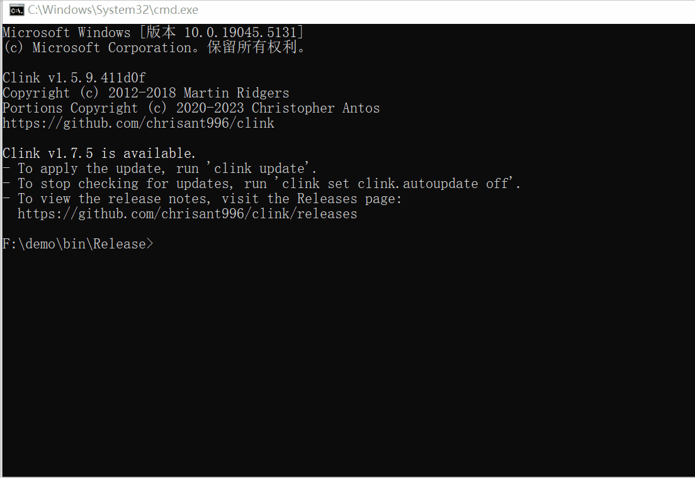
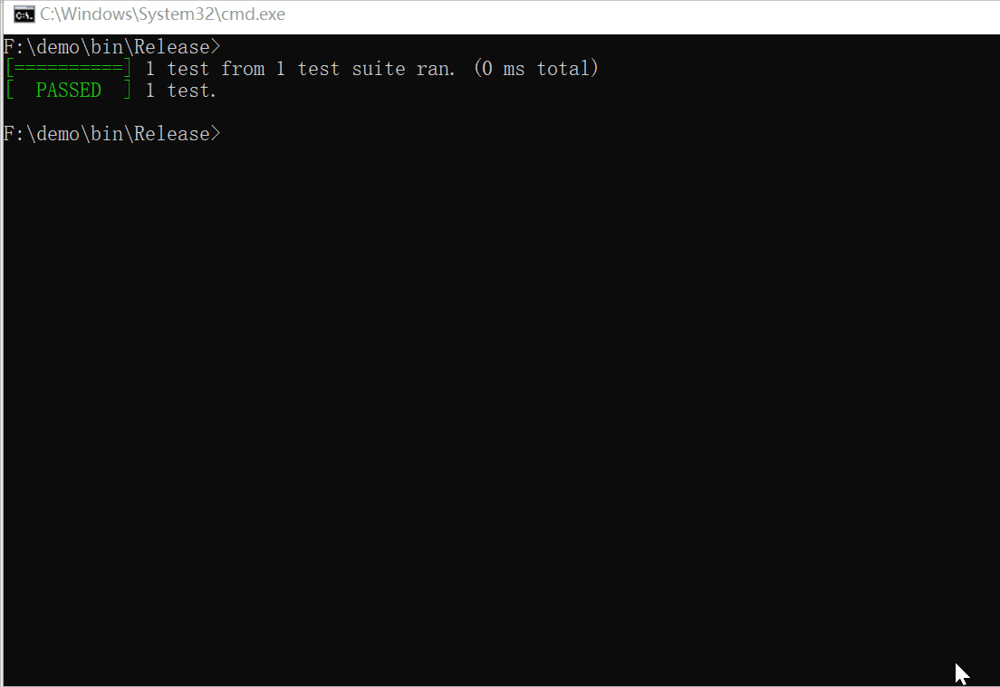
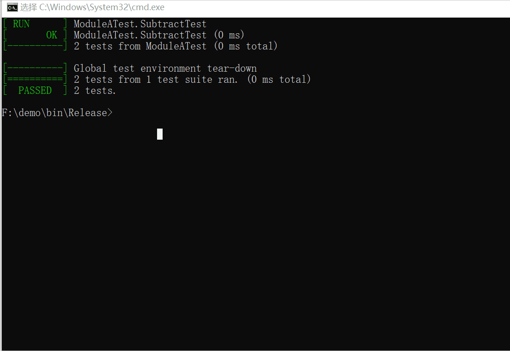
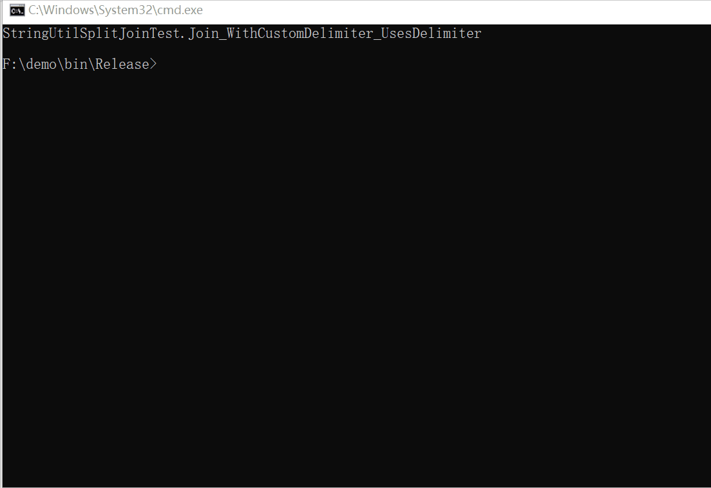

# GTest DLL Testing Framework

[English](./README.md) | [中文](./README_CN.md)

A modern C++ testing framework that demonstrates how to effectively test DLL modules using Google Test. This project provides a flexible and extensible architecture for testing DLL-based applications.


## ✨ Features

- 🔌 Dynamic loading of test DLLs at runtime
- 🎯 Modular test organization
- 📊 Hierarchical test result display
- 🛠️ Easy-to-use command line interface
- 🔍 Flexible test filtering capabilities
- 📦 CMake-based build system

## 🚀 Quick Start

### Prerequisites

- CMake 3.20 or higher
- Visual Studio 2022 (Windows)
- C++14 compatible compiler

### Building the Project
1. Clone the repository:
   ```bash
   git clone https://github.com/lemoabc/gtest-dll-testing.git
   cd gtest-dll-testing
   ```
2. Create a new directory for the build files:
   ```bash
   mkdir build
   cd build
   ```
3. Configure and build
   ```bash
   cmake -B build -G "Visual Studio 17 2022" -A x64 -DCMAKE_BUILD_TYPE=Release
   cmake --build build --config Release
   ```
4. Install
   ```bash
   cmake --install . --prefix ./install
   ```

### Running Tests

#### List all available tests


```bash
test_runner.exe --list
```

#### Run specific test


```bash
test_runner.exe --run TestSuite.TestName
```
#### Run specific module tests


```bash
test_runner.exe --run-module ModuleName
```
#### Run all tests


```bash
test_runner.exe --run-all
```

#### Tests Help


```bash
test_runner.exe --help
```

## 📖 Documentation

### Project Structure
```bash
project/
├── src/ # Source code
│ ├── ModuleA/ # Module A implementation
│ └── ModuleB/ # Module B implementation
├── tests/ # Test code
│ ├── ModuleATest/ # Module A tests
│ ├── ModuleBTest/ # Module B tests
│ └── test_runner/ # Test runner implementation
└── CMakeLists.txt # Main CMake configuration
```

### Adding New Modules

1. Create a new module directory under `src/`
2. Add source files and `CMakeLists.txt`
3. Create corresponding test directory under `tests/`
4. Register the test DLL in `test_runner/test_main.cpp`

## 🤝 Contributing

Contributions are welcome! Please feel free to submit a Pull Request. For major changes, please open an issue first to discuss what you would like to change.

## 📄 License

This project is licensed under the MIT License - see the [LICENSE](LICENSE) file for details.

## 🌟 Star History

[](https://star-history.com/#lemoabc/gtest-dll-testing&Date)

## 🙏 Acknowledgments

- [Google Test](https://github.com/google/googletest)
- All contributors who have helped this project