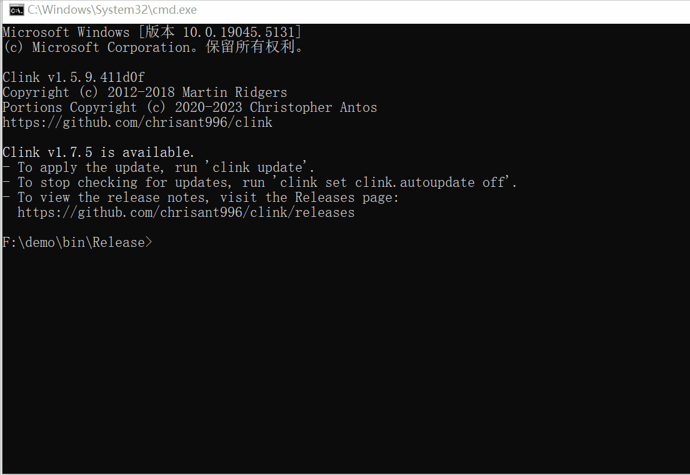
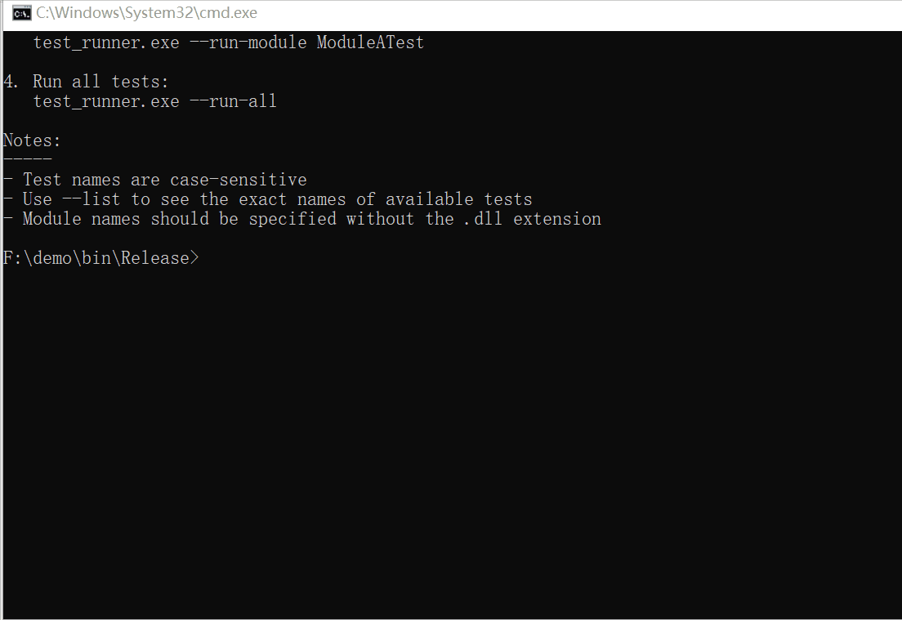
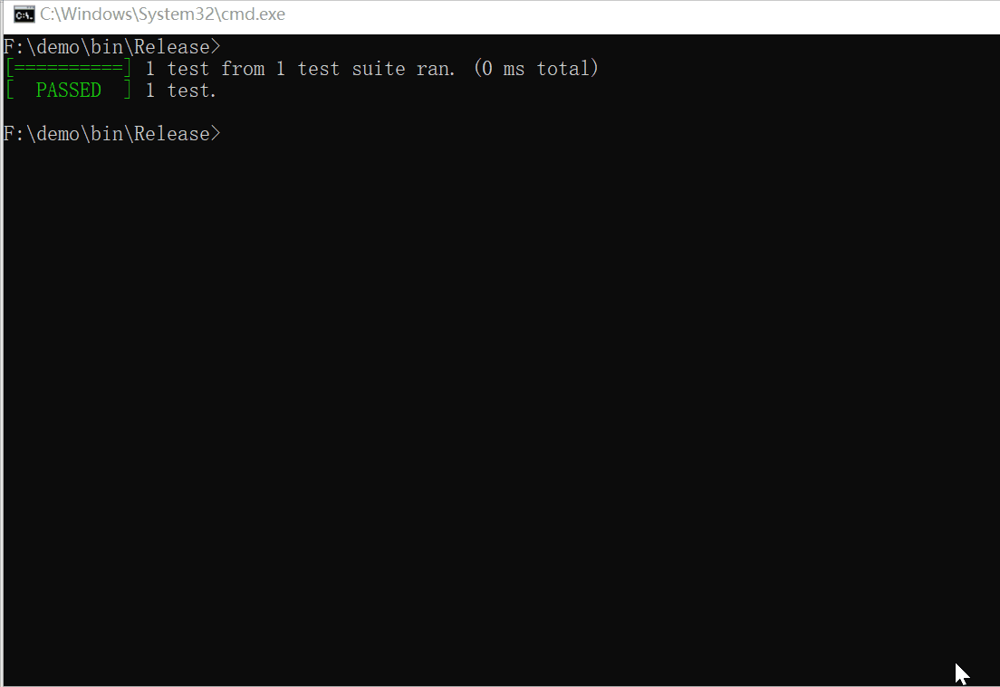
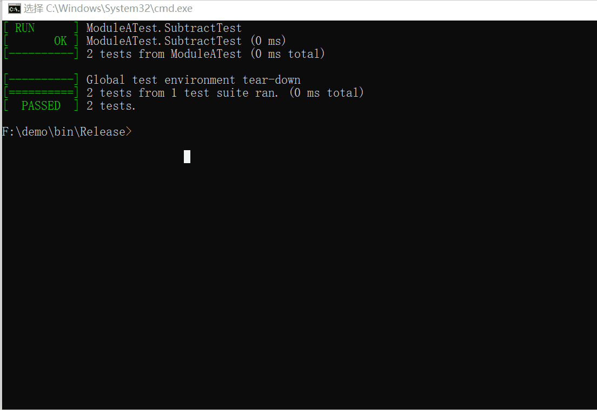
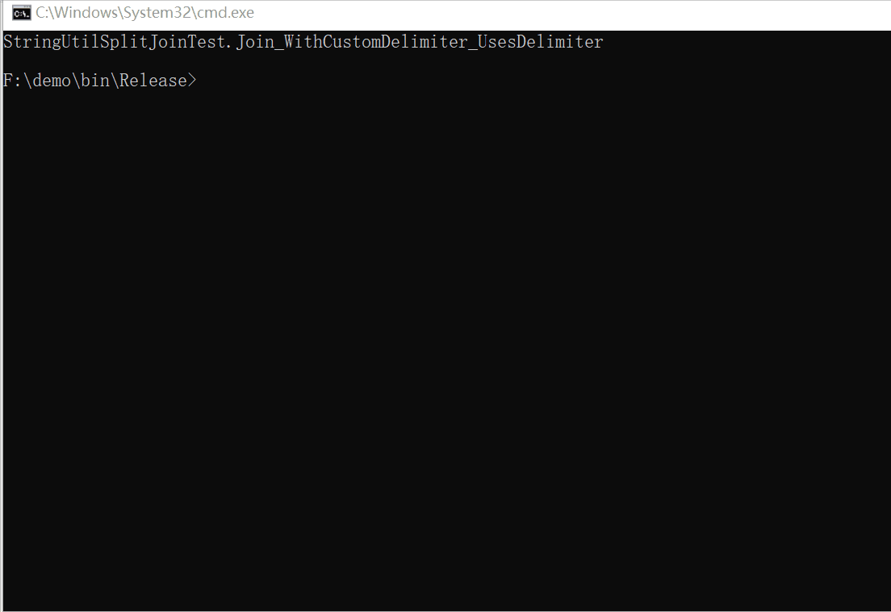

# GTest DLL 测试框架

一个现代化的 C++ 测试框架，展示如何使用 Google Test 高效测试 DLL 模块。本项目提供了一个灵活且可扩展的架构，用于测试基于 DLL 的应用程序。


## ✨ 特性

- 🔌 运行时动态加载测试 DLL
- 🎯 模块化的测试组织
- 📊 层次化的测试结果显示
- 🛠️ 简单易用的命令行界面
- 🔍 灵活的测试过滤功能
- 📦 基于 CMake 的构建系统

## 🚀 快速开始

### 环境要求

- CMake 3.20 或更高版本
- Visual Studio 2022 (Windows)
- 支持 C++14 的编译器

### 构建项目
1. 克隆仓库：
   ```bash
   git clone https://github.com/lemoabc/gtest-dll-testing.git
   cd gtest-dll-testing
   ```
2. 创建构建目录：
   ```bash
   mkdir build
   cd build
   ```
3. 配置并构建：
   ```bash
   cmake -B build -G "Visual Studio 17 2022" -A x64 -DCMAKE_BUILD_TYPE=Release
   cmake --build build --config Release
   ```
4. 安装：
   ```bash
   cmake --install . --prefix ./install
   ```

### 运行测试

#### 列出所有可用测试


```bash
test_runner.exe --list
```

#### 运行指定测试


```bash
test_runner.exe --run TestSuite.TestName
```

#### 运行指定模块


```bash
test_runner.exe --run-module ModuleName
```

#### 运行所有测试


```bash
test_runner.exe --run-all
```

#### 测试帮助


```bash
test_runner.exe --help
```

## 📖 文档

### 项目结构
```bash
project/
├── src/ # 源代码
│ ├── ModuleA/ # 模块 A 实现
│ └── ModuleB/ # 模块 B 实现
├── tests/ # 测试代码
│ ├── ModuleATest/ # 模块 A 测试
│ ├── ModuleBTest/ # 模块 B 测试
│ └── test_runner/ # 测试运行器实现
└── CMakeLists.txt # 主 CMake 配置文件
```

### 添加新模块

1. 在 `src/` 下创建新的模块目录
2. 添加源文件和 `CMakeLists.txt`
3. 在 `tests/` 下创建对应的测试目录
4. 在 `test_runner/test_main.cpp` 中注册测试 DLL

## 🤝 贡献

欢迎贡献！请随时提交 Pull Request。对于重大更改，请先开启一个 issue 来讨论您想要更改的内容。

## 📄 许可证

本项目采用 MIT 许可证 - 详情请参见 [LICENSE](LICENSE) 文件。

## 🌟 Star 历史

[](https://star-history.com/#lemoabc/gtest-dll-testing&Date)

## 🙏 致谢

- [Google Test](https://github.com/google/googletest)
- 所有为这个项目做出贡献的人
